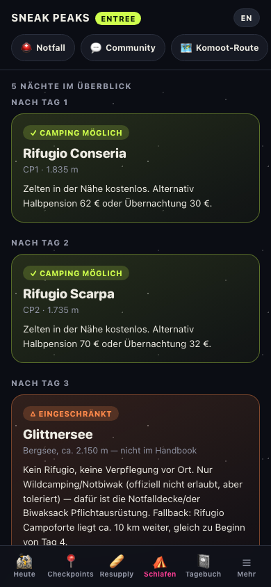

# 🏔️ ENTREE Feldbuch — SNEAK PEAKS 2026

Dein persönlicher, offline-fähiger Begleiter für die **ENTREE-Route** des SNEAK PEAKS Bikepacking-Events 2026 (Start/Ziel Bozen, 30. August, ~495 km, 5–7 Tagesetappen je nach Tempo).

Keine Anmeldung, kein Server, keine Werbung — alles läuft direkt auf deinem Handy und funktioniert auch komplett ohne Netz.

  
  
  

---

## Was kann die App?

**Für dich als Fahrer:in ist das dein digitales Feldbuch** — statt zwischen PDFs, Komoot und Notizen hin- und herzuspringen, hast du alles Wichtige an einem Ort, auch tief in den Dolomiten ganz ohne Empfang.

### 📍 Heute — dein Tagesüberblick

Karte, Höhenprofil, Wetter und Schlafmöglichkeit für die aktuelle Etappe auf einen Blick. Die Karte lässt sich zoomen und zeigt (mit Standortfreigabe) deine eigene Position live auf der Strecke.

### 🗺️ Checkpoints & Resupply

Alle offiziellen Checkpoints und Verpflegungsstationen der Route — mit Öffnungszeiten, Essen, Preisen, Camping-Möglichkeiten und Kontaktdaten. Antippen für Details, inklusive direktem Anruf-Link.

### ⛺ Schlafen

Für jede Nacht siehst du sofort: gibt's ein Bett, ist Camping erlaubt, oder wird's ein Wildbiwak? Ehrlich markiert, auch wenn's mal ungemütlich wird.

### 📓 Tagebuch

Die App stellt dir übers Tempo verteilt kurze, spontane Fragen ("Welcher Moment bleibt dir von heute?", "Schmerz-Level gerade?"...) — ideal für kurze Video-Tagebuch-Momente. Antworten werden zusammen mit Ort und Zeitpunkt gespeichert und später auf einer kleinen Karte deiner Tour sichtbar.

### ▶️ Story-Modus & Video-Export

Für jeden Tag gibt's eine kleine animierte Zusammenfassung direkt in der App — und einen Ein-Klick-Export als fertiges Hochformat-Video (1080×1920), perfekt als Intro für Instagram/YouTube Shorts. Alles wird direkt auf deinem Gerät gerendert, nichts wird hochgeladen.

### 🆘 Notfall

Ein Tap zeigt deine exakten GPS-Koordinaten groß auf dem Bildschirm — zum Vorlesen am Telefon im Ernstfall — plus die Pflichtausrüstungs-Checkliste und Notfallkontakte.

### ☰ Mehr

Zeitplan, Pflicht- und empfohlene Ausrüstung (mit Abhak-Liste), Tracker-Anleitung, Sicherheitshinweise, alle Ausstiegsoptionen entlang der Strecke und Bike-Tipps.

---

## Einmaliges Setup — dann läuft's von allein

Beim ersten Öffnen fragt dich die App kurz nach deinem Namen und deiner Route:

- **Party Pace Patrol · Lotti** — Lottis fertiger 5-Tage-Plan, alles schon vorbereitet
- **Party Pace Patrol · Paula** — Paulas fertiger 6-Tage-Plan mit Zwischenstopp am Lago Federa
- **ENTREE komplett** — die ganze Strecke, du legst deine eigenen Etappen fest

 

Danach merkt sich die App alles **nur auf deinem Gerät** (kein Konto, kein Server) — du musst das Setup nie wieder durchlaufen.

## Auf dem iPhone installieren (empfohlen)

1. Die App-URL in **Safari** öffnen (nicht Chrome — auf dem iPhone gilt hier immer Safaris Engine).
2. Teilen-Symbol antippen → **„Zum Home-Bildschirm"**.
3. Fertig — sie startet ab jetzt wie eine echte App, ohne Browser-Leiste, und funktioniert offline.

## Sprache

Oben rechts kann jederzeit zwischen **Deutsch und Englisch** umgeschaltet werden (`DE`/`EN`-Button) — auch direkt im Setup, für Teilnehmer:innen, die kein Deutsch sprechen.

## Wichtig zu wissen

- Nur die Wettervorhersage braucht kurz Empfang zum Aktualisieren — alles andere funktioniert offline.
- Karte und Höhenprofil sind **schematisch** (Luftlinie bzw. angenähert aus bekannten Pass-/Checkpoint-Höhen), keine exakten GPS-Tracks. Für die tatsächliche Navigation gilt die Komoot-Route.
- Diese App ersetzt keine Rechtsberatung, keine Notfallausrüstung und keine eigene Streckenkenntnis — im Zweifel zählt immer das offizielle Rider Handbook.

---

*Kein offizielles SNEAK-PEAKS-Produkt — ein privates Fahrer:innen-Tool, gebaut fürs eigene Team.*
