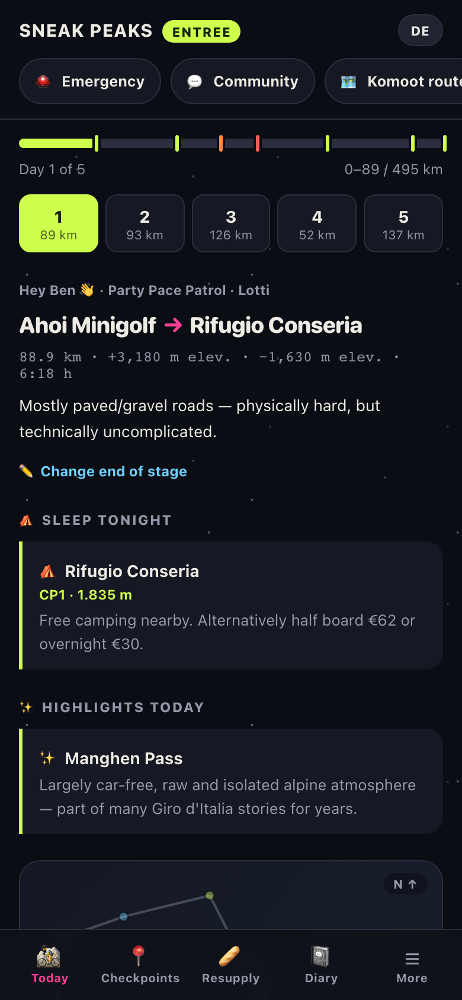
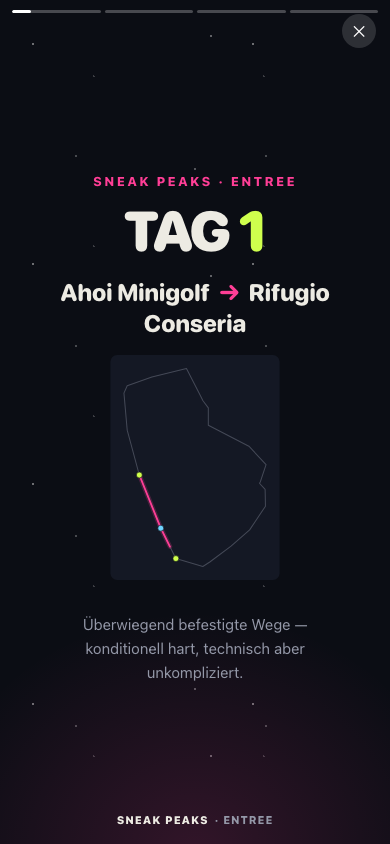
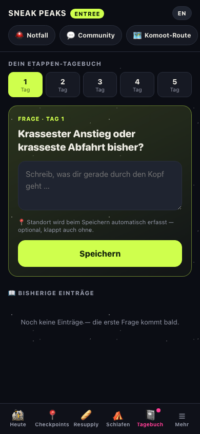
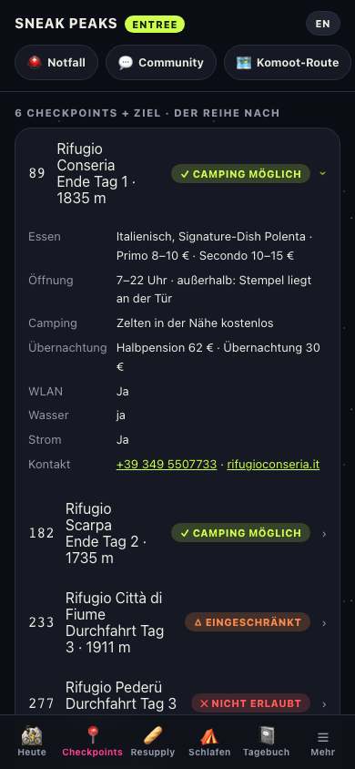
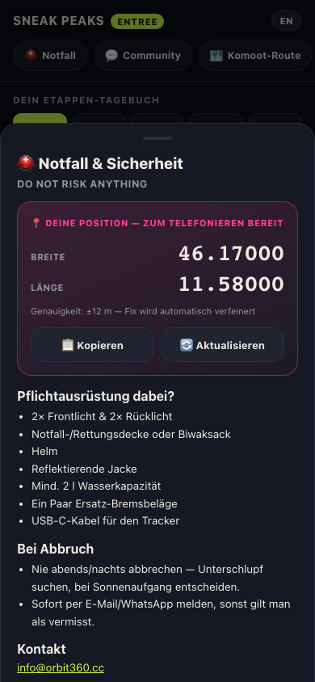
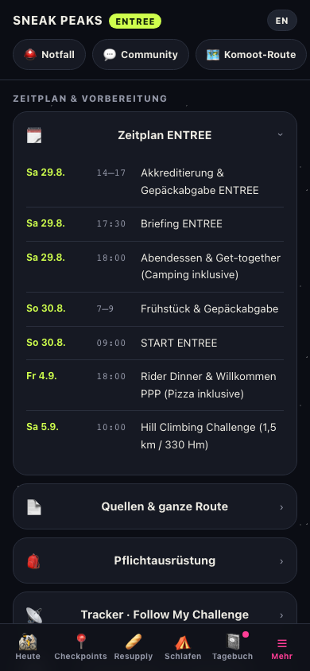
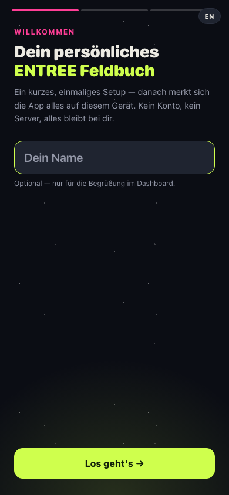
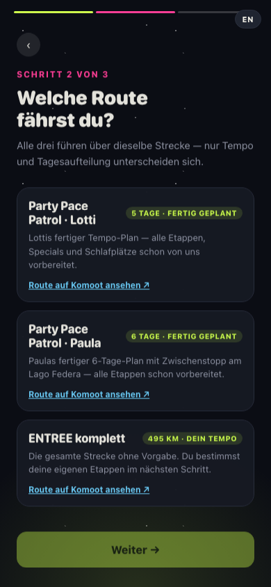

# 🏔️ Entree Guide — SNEAK PEAKS 2026

Your personal, offline-capable companion for the **ENTREE route** of the SNEAK PEAKS 2026 bikepacking event (start/finish Bolzano, August 30, ~495 km, 5–7 daily stages depending on pace).

No sign-up, no server, no ads — everything runs directly on your phone and works completely without a connection.

  
  
  

---

## 🔒 Your data stays on your phone

This app collects **no personal data at all**. There's no account, no login, no analytics, no tracking, and no backend server that stores anything about you — everything (your name, chosen route, diary entries, adjusted stages) lives only in your browser's local storage, on your own device. Nobody, including whoever built this app, can see any of it.

The app only reaches out to the internet or your device's GPS for these specific, limited purposes — never silently, never in the background beyond what's listed:

**Needs an internet connection for:**
- Loading the app the very first time (after that, it's cached on your device and works offline)
- Refreshing the weather forecast (queries [Open-Meteo](https://open-meteo.com), a free public weather API — only the coordinates needed for that one forecast are sent, nothing else)
- Opening external links you tap yourself (Komoot routes, the rider handbook PDF, the Bergwetter Südtirol alpine forecast, the Outta app) — these open in your browser like any other link

**Needs GPS/location access for:**
- Showing your live position on the route map (only if you tap the location button — off by default)
- "Adjust end of today's stage" — logging where you actually stopped
- The Emergency tab's large coordinate readout
- Tagging a diary entry with where you wrote it (optional, best-effort)
- Getting the weather forecast for your current position instead of the day's planned location

If you never tap a location button, the app never touches your GPS. If you're offline, everything keeps working except the weather refresh and the external links above.

---

## What can the app do?

**As a rider, this is your digital field book** — instead of jumping between PDFs, Komoot and notes, you have everything important in one place, even deep in the Dolomites with zero signal.

### 📍 Today — your daily overview

Route, distance, elevation, tonight's sleep spot and any warnings for the day, all at a glance, followed by an hourly weather forecast and a full interactive map (zoom, pan, tap any point for details, optionally show your live GPS position) with the elevation profile right underneath.

Riding more or less than planned? Tap "Adjust end of today's stage" to log your actual GPS position and a name for where you stopped — the app reshuffles the remaining days automatically, and adds an extra day at the end if you haven't reached the finish yet.

### 🗺️ Checkpoints & overnight stops

Every official checkpoint plus every night's stop, in one list ordered by route kilometer — including wild-camp nights that aren't official checkpoints (like Glittnersee or Lago Federa). Each row shows two things at a glance, no need to tap: whether there's an actual **bed** available, and whether **camping** is allowed there. Tap for full details — opening hours, food, prices, and a direct call link.

### 📓 Diary

The app asks short, spontaneous questions spread out over your ride ("What moment will you remember from today?", "Pain level right now?" ...) — perfect for quick video-diary moments. Answers are saved together with location and time, and later visible on a small map of your tour. You can export the whole diary as one long image in the app's own visual style.

### ▶️ Story mode & video export

Every day gets a short animated summary right inside the app — and a one-tap export as a ready-made portrait video (1080×1920), perfect as an intro for Instagram/YouTube Shorts. Everything renders directly on your device, nothing gets uploaded.

### 🆘 Emergency

One tap shows your exact GPS coordinates large on the screen — to read out over the phone in an emergency — plus the mandatory-gear checklist and emergency contacts.

### ☰ More

Schedule, mandatory and recommended gear (with a checklist), tracker instructions (including who to contact if your Follow My Challenge tracker breaks), safety notes, every bail-out option along the route, and bike tips.

---

## ⚠️ What this app can't do

To set expectations clearly:

- **Only covers the ENTREE route.** There are no route profiles, checkpoints, or day-plans for the CLASSIC or ADVENTURE routes — if you're riding one of those, this app currently has nothing for you.
- **Map and elevation profile are schematic**, not exact GPS tracks (straight-line distances resp. approximated from known pass/checkpoint elevations). For actual navigation, the **Komoot route is authoritative**, not this app.
- **Weather comes from a general-purpose forecast** (Open-Meteo), not a specialized alpine/mountain weather service. For critical passages, also check a dedicated alpine forecast (there's a direct link to the Bergwetter Südtirol Dolomites forecast right in the weather card).
- **Not a substitute for the official Rider Handbook, mandatory equipment, or your own route knowledge.** When in doubt, the handbook always takes precedence.
- **Not the mandatory event communication channel.** SNEAK PEAKS requires every rider to separately install the [Outta app](https://outta-app.com/en/outta-app/) and join the event there for route updates, weather warnings, and messages between riders. This field book is a personal companion on top of that, not a replacement for it.
- **No turn-by-turn navigation.** It's a reference and planning companion you check at a glance, not something you follow live like a GPS bike computer.

---

## One-time setup — then it just runs

The first time you open it, the app briefly asks for your name and your route:

- **Party Pace Patrol · Lotti** — Lotti's finished 5-day plan, everything prepared
- **Party Pace Patrol · Paula** — Paula's finished 6-day plan with a stop at Lago Federa
- **ENTREE complete** — the full route, you set your own daily stages

 

After that, the app remembers everything **only on your device** (no account, no server) — you never have to go through setup again.

## Installing the app

Installing means it starts like a real app from your home screen, with no browser address bar, and works fully offline afterward. It's the same website either way — installing just makes it feel native and removes the need to reconnect.

### iPhone / iPad (Safari)

1. Open the app URL in **Safari** (not Chrome — on iOS, Safari's engine always applies here, even inside other browsers).
2. Tap the **Share** icon (square with an arrow) in the toolbar.
3. Scroll down and tap **"Add to Home Screen"**.
4. Tap **"Add"** in the top right.
5. Done — launch it from your home screen like any other app, labeled **Entree Guide**.

### Android (Chrome)

1. Open the app URL in **Chrome**.
2. Chrome usually shows an **"Install app"** banner or an install icon (⊕) directly in the address bar — tap it. If you don't see it, tap the **⋮** menu in the top right and choose **"Add to Home screen"** or **"Install app"**.
3. Confirm by tapping **"Install"**.
4. Done — launch it from your home screen or app drawer, labeled **Entree Guide**.

(Other Chromium-based Android browsers — Edge, Samsung Internet, Brave — support the same "Add to Home Screen" install flow.)

## Language

The `DE`/`EN` button in the top right switches between **German and English** at any time — including directly during setup, for participants who don't speak German.

---

*Not an official SNEAK PEAKS product — a private rider tool, built for our own team.*
